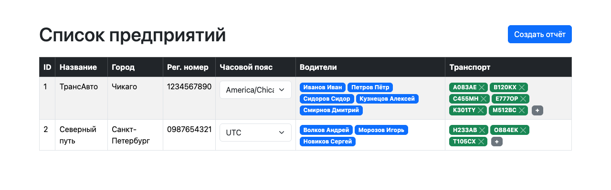
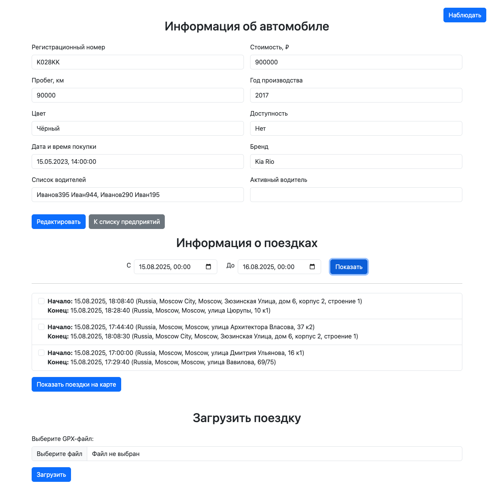
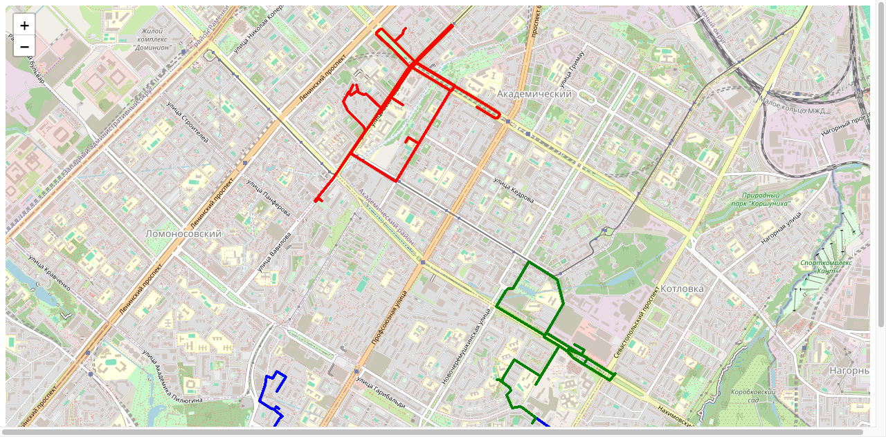
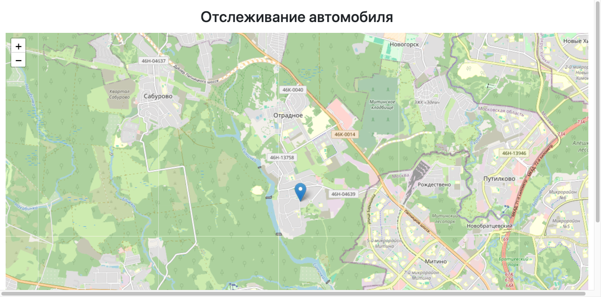
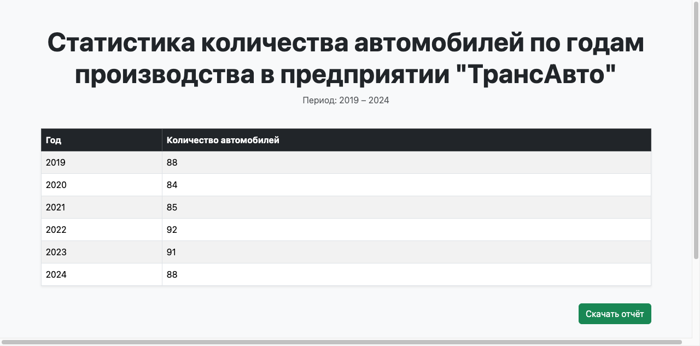
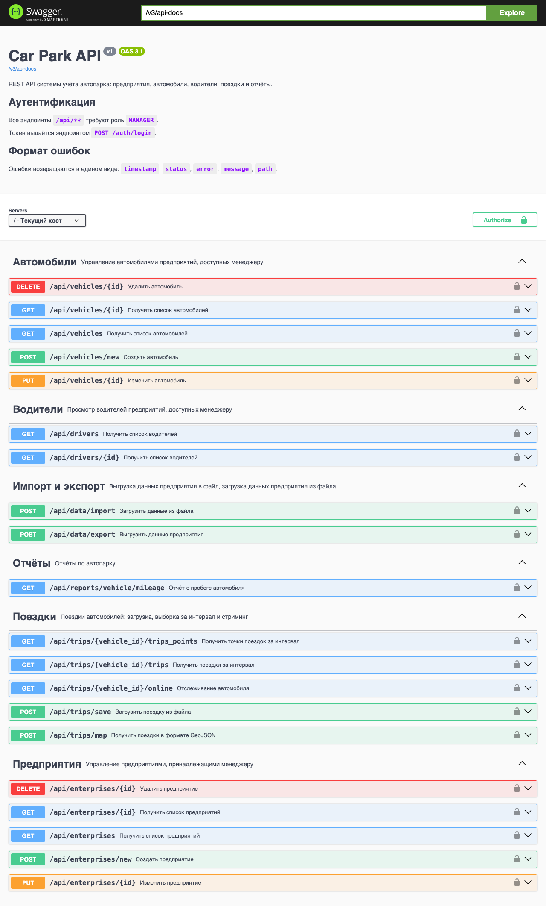
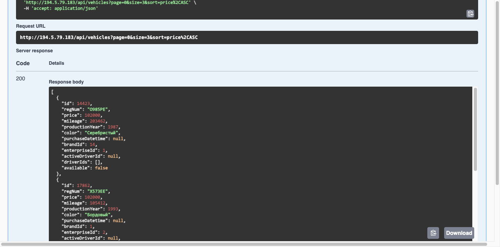
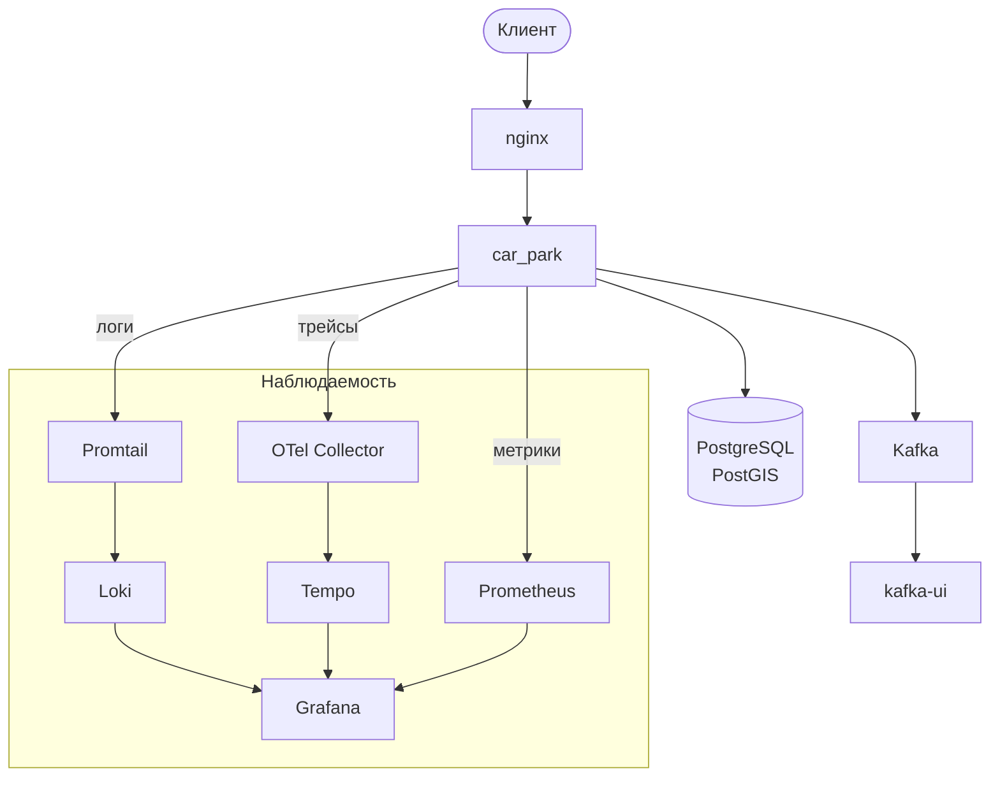

<div align="center">

# 🚗 car_park

**Учёт автопарка**: предприятия, транспорт, водители, треки и отчёты

[](https://github.com/tihiyn/car_park/actions/workflows/pipeline.yml)


[Функционал](#features) ·
[Архитектура](#architecture) ·
[Стек](#stack) ·
[Структура](#structure) ·
[Запуск](#run) ·
[Деплой](#deploy) ·
[Тесты](#tests) ·
[Мониторинг](#monitoring)

</div>

Веб-приложение для учёта автопарка. Транспортные средства (далее ТС) и водители закреплены за предприятиями,
предприятия находятся под управлением менеджеров. Положение ТС отслеживается и хранится для построения отчётов.

Приложение состоит из серверного UI на Thymeleaf и REST API.

<p align="center">
  
</p>
<p align="center"><em>Список предприятий</em></p>

---

<a id="features"></a>

## ✨ Функционал

### 🏢 Предприятия

Предприятия описываются городом, регистрационным номером и собственным часовым поясом.
Все даты - покупка автомобиля, начало и конец поездки, границы
отчётного интервала отображаются относительно часового пояса предприятия.

### 🚙 ТС и водители

ТС относится к предприятию и имеет бренд (бренд описывается типом, КПП, объёмом и
мощностью двигателя, числом мест). За автомобилем закреплены водители, один из
которых может быть активным.

<p align="center">
  
</p>
<p align="center"><em>Карточка ТС и его поездки за выбранный период</em></p>

### 🧭 Поездки и треки

Поездка загружается из GPX-файла. Новая поездка не должна пересекаться по времени с уже существующими.
Координаты начала и конца поездки преобразуются в адреса при помощи внешнего сервиса Geoapify.
После добавления новой поездки всем менеджерам предприятия отправляются уведомления в Telegram-бота.

Выбранные поездки отрисовываются на карте (Leaflet + OpenStreetMap), каждая своим
цветом. Выдача точек по REST доступна в формате списка или GeoJSON.

<p align="center">
  
</p>
<p align="center"><em>Три поездки одного ТС, каждая своим цветом</em></p>

### 📡 Наблюдение за автомобилем

За положением каждого ТС можно наблюдать через UI.

> [!NOTE]
> Для демонстрации координаты **симулируются**. Для продакшен использования
> достаточно добавить считывание местоположения с CAN-шины.

<p align="center">
  
</p>
<p align="center"><em>Онлайн-слежение: маркер двигается по потоку Server-Sent Events</em></p>

### 📊 Отчёты

Доступна генерация 3 видов отчётов: пробег ТС с агрегацией по дням, месяцам или годам;
распределение ТС предприятия по годам производства; средняя зарплата
водителей предприятия. Любой отчёт выгружается в формате xlsx.

<p align="center">
  
</p>
<p align="center"><em>Распределение ТС предприятия по годам производства</em></p>

### 🔄 Импорт и экспорт

Данные предприятия (ТС, водители, поездки) выгружаются и загружаются в форматах JSON или CSV.

### 🔌 REST API

Документация генерируется springdoc и доступна на `/swagger-ui.html`
(спецификация - `/v3/api-docs`).

<p align="center">
  
</p>
<p align="center"><em>Swagger UI: все эндпоинты, сгруппированные по тегам</em></p>

<details>
<summary><b>Пример ответа REST API</b></summary>

<p align="center">
  
</p>
<p align="center"><em><code>GET /api/vehicles</code>, выполненный прямо из Swagger UI</em></p>

</details>

---

<a id="architecture"></a>

## 🧱 Архитектура

Прод разворачивается через Docker Compose:



### Модель данных

| Сущность | Таблица | Ключевые связи |
|---|---|---|
| `Enterprise` | `enterprises` | автомобили, водители, менеджеры; `time_zone` |
| `Vehicle` | `vehicle` | `Brand`, `Enterprise`, активный водитель, `@ManyToMany` водители |
| `Driver` | `drivers` | предприятие; уникальные права; обратная связь на активный автомобиль |
| `Manager` | `managers` | `@OneToOne User` + `@ManyToMany` предприятия (`manager_enterprise_assignments`) |
| `Trip` | `trips` | автомобиль, начало и конец как `ZonedDateTime` |
| `VehicleLocation` | `vehicle_locations` | автомобиль, `Point` в PostGIS, метка времени |
| `User`, `Role` | `users`, `roles`, `user_roles` | роли `ROLE_ADMIN`, `ROLE_MANAGER`, `ROLE_USER` |

### Аутентификация

Вход по логину и паролю на `POST /auth/login`. Сервер выдаёт JWT в **HttpOnly-cookie `JWT`**.

Все `/api/**` требуют роль `MANAGER`.

---

<a id="stack"></a>

## 🧰 Стек

| Слой | Технологии |
|---|---|
| Язык, сборка | Java 21, Maven |
| Каркас | Spring Boot 3.4.5: web, webflux, data-jpa, security, thymeleaf, batch, kafka, validation, actuator |
| БД | PostgreSQL 17 + PostGIS, Hibernate Spatial |
| Фронтенд | Thymeleaf, Bootstrap 5, Leaflet 1.9 + OpenStreetMap |
| Прочее | MapStruct, Lombok, JWT, Apache POI, jpx (GPX), springdoc-openapi |
| Наблюдаемость | Micrometer + Prometheus, OpenTelemetry + Tempo, Logback + Loki |
| Инфраструктура | Docker Compose, nginx, Kafka (KRaft), Grafana |

---

<a id="structure"></a>

## 📦 Структура репозитория

<details>
<summary><b>Дерево каталогов</b></summary>

```
src/main/java/com/example/car_park/   приложение
src/main/resources/
├── templates/                        шаблоны Thymeleaf
├── static/map.html                   карта с треками
├── db/e2e/data.sql                   инит-файл e2e профиля
└── application-example.properties    шаблон конфига
e2e/                                  Cypress-тесты
monitoring/                           конфиги Prometheus, Grafana, Tempo, Loki
k6/                                   нагрузочные тесты
nginx/default.conf                    конфигурация nginx
.github/workflows/pipeline.yml        CI/CD
docker-compose.yaml                   docker-compose файл для развёртывания
```

</details>

---

<a id="run"></a>

## 🚀 Запуск

Быстрый способ без БД - профиль `e2e`:

```bash
./mvnw spring-boot:run -Dspring-boot.run.profiles=e2e
```

Поднимется H2 в памяти, схему создаст Hibernate, данные заполнятся из
`src/main/resources/db/e2e/data.sql`, Geoapify заменится заглушкой. Приложение
будет доступно на `http://localhost:8080`, войти можно как `АнисимовВС` (пароль - в
`e2e/cypress.env.json`).

Полноценный запуск в Docker:

```bash
docker compose up -d
```

> [!IMPORTANT]
> Перед деплоем необходимо добавить в корень проекта следующие файлы:
>
> - `.env` - переменные для Compose, см. список ниже
> - `src/main/resources/application.properties` - конфиг приложения; шаблон - `application-example.properties`
> - `db-init/` - SQL-скрипты создания схемы, монтируются в `/docker-entrypoint-initdb.d`

Переменные в `.env`:

- `DB_NAME`, `DB_USER`, `DB_PASSWORD` - креды для БД
- `GRAFANA_PASSWORD`, `GRAFANA_ROOT_URL` - креды для Grafana
- `SMTP_HOST`, `SMTP_USER`, `SMTP_PASSWORD`, `ALERT_EMAIL` - креды для алертов на почту
- `ALERTS_WEBHOOK_TOKEN` - секрет для вебхука алертов в Telegram-бота

---

<a id="deploy"></a>

## 🔧 Деплой

Деплой описан в `.github/workflows/pipeline.yml` и запускается при push в `main`.

- Джоба `ci` идёт на каждый push и pull request в `main`
- Джоба `cd` идёт только на push в `main` и только после успешной `ci`

---

<a id="tests"></a>

## 🧪 Тесты

```bash
mvn test
cd e2e && npm install && npm run cy:run
```

Нагрузочный сценарий на k6 лежит в `/k6` и запускается сервисом `k6` из Compose.

---

<a id="monitoring"></a>

## 📈 Мониторинг

Метрики собирает Prometheus с `/actuator/prometheus`, трейсы приложение шлёт по
OTLP в коллектор и дальше в Tempo, логи Promtail собирает из файлов и из Docker и
складывает в Loki. Всё это визуализировано в Grafana. Дашборды, датасорсы и правила
алертов задаются как код в `monitoring/grafana/provisioning`. Алерты уходят в
Telegram-бота и на почту.
